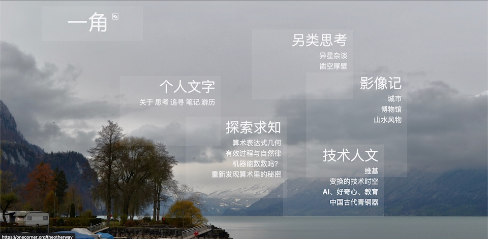

十余年程序员生涯，游走于工程、语言、知识、智能、数学这些关键词之间，内心对世界充满很多好奇和困惑，尝听友人讲大刘《山》的故事，也期自己可凭蛮力，凿空厚壁，得见星空。

During more than ten years of programming career, I wandered between engineering, language, knowledge, intelligence, and mathematics. I am full of curiosity and confusion about the world.
I heard the story of "Mountain" by Cixin Liu, and I hope I can also carve out a hole in the thick wall with brute force and see the stars.

* My blog: https://onecorner.org/

